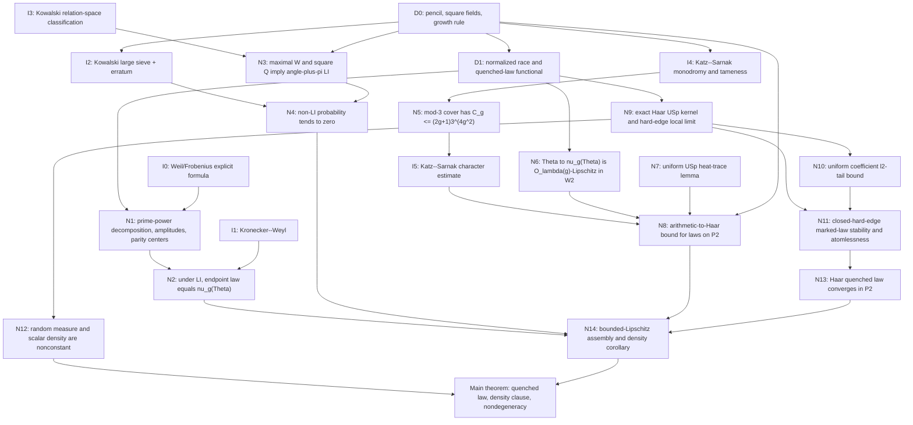

# Focused-paper architecture: simultaneous hyperelliptic hard-edge law

Status: internal architecture, 2026-08-17. This plan is conditional on a clean
priority audit. It does not assert novelty, submission readiness, or complete
formal verification. It is for a new focused paper only; the frozen broad
manuscript is out of scope.

## 1. Paper thesis and scope

The paper should prove one result: the entire quenched limiting law of a
weighted prime race in an explicit one-parameter hyperelliptic pencil has a
simultaneous large-field/large-genus limit in
\(\mathcal P_2(\mathbb R)\). The limit is a random probability measure built
from the symplectic hard-edge process. The race density is then a corollary by
evaluating this law on \((0,\infty)\). The contribution is the quantitative
assembly: density-one linear independence, genus-explicit
arithmetic-to-Haar transfer for a probability-measure-valued functional, and
passage from Haar symplectic eigenangles to the marked hard-edge series.

The paper must call this a **simultaneous large-field/large-genus bridge
theorem**. It must not call it a fixed-field microscopic theorem, a solution of
the Katz--Sarnak low-zero problem, the first theorem of its kind, or a practical
field-size result. The condition on the field is deliberately conservative and
astronomical.

There should be one numbered main theorem. The race-density convergence,
expectation statement, and nondegeneracy of the random measure are clauses of
that theorem, not separate headline results. The explicit canonical sequence is
an `in particular` clause, not a separate result.

## 2. Recommended headline theorem

The strongest clean statement costs no more proof than the single canonical
sequence. Fix \(\lambda>0\). Let \(Q_g\) be odd square prime powers, with
characteristic \(p_g>2g+1\), such that

\[
  \frac{\log Q_g}{g^2\log(g+2)}\longrightarrow\infty.
\]

Put

\[
 f_g(x)=\prod_{a=1}^{2g}(x-a),\qquad
 U_g=\mathbb A^1\setminus\{1,\ldots,2g\},
 \qquad C_{g,t}:y^2=f_g(x)(x-t),
\]

and choose \(t_g\) uniformly from \(U_g(\mathbb F_{Q_g})\). Use
\(M_g=\lambda/((2g+1)\log Q_g)\), equivalently
\(m_g=M_g-1/2\), in the normalized inert-minus-split degree race. On the LI
set, let \(\nu_{g,t_g,\lambda}\in\mathcal P_2(\mathbb R)\) be its natural
endpoint limiting distribution. Equivalently, if \(\vartheta_1,\ldots,
\vartheta_g\) are the positive Frobenius angles, then

\[
 \nu_{g,t,\lambda}=\frac12\sum_{\epsilon=0}^1
 \operatorname{Law}_{\Phi}\!\left(
 c_{g,\lambda}^{(\epsilon)}+
 \sum_{j=1}^g b_{g,\lambda}(\vartheta_j)\cos\Phi_j
 \right).
\]

Extend \(\nu_{g,t_g,\lambda}\) by one fixed measure, say \(\delta_0\), on the
exceptional non-LI set. Define the random hard-edge law

\[
 \nu_\lambda(\mu)=\operatorname{Law}_{\Phi}\!\left(
  1+\sum_{y\in\mu}
  \frac{4\lambda}{\sqrt{\lambda^2+(2\pi y)^2}}\cos\Phi_y
 \right),
\]

where the series is interpreted in conditional \(L^2\). The headline
conclusion is

\[
 \boxed{\quad
 \nu_{g,t_g,\lambda}\ \Longrightarrow\
 \nu_\lambda(\Pi_{\mathrm{Sp}})
 \quad\text{as random elements of }
 (\mathcal P_2(\mathbb R),W_2).\quad}
\]

where \(\Pi_{\mathrm{Sp}}\) has kernel

\[
 K_{\mathrm{Sp}}(x,y)
 =\frac{\sin\pi(x-y)}{\pi(x-y)}
  -\frac{\sin\pi(x+y)}{\pi(x+y)}
\]

on \((0,\infty)\), and the marks \(\Phi_y\) are conditionally independent and
uniform on \([0,2\pi]\). The limiting random measure is nonconstant: its
conditional mean is one and its conditional variance is

\[
 V_\lambda(\Pi_{\mathrm{Sp}})
 =\frac12\sum_{y\in\Pi_{\mathrm{Sp}}}
 \frac{16\lambda^2}{\lambda^2+(2\pi y)^2},
\]

and \(\operatorname{Var}(V_\lambda(\Pi_{\mathrm{Sp}}))>0\). The limiting law
is almost surely absolutely continuous: the hard-edge process has a first
point, its marked arcsine summand is absolutely continuous, and it is
independent of the remaining \(L^2\)-convergent series. Thus atomlessness at
zero gives, by the continuous mapping theorem,

\[
 \delta_{g,t_g,\lambda}
 :=\nu_{g,t_g,\lambda}((0,\infty))
 \Longrightarrow
 F_\lambda(\Pi_{\mathrm{Sp}})
 :=\nu_\lambda(\Pi_{\mathrm{Sp}})((0,\infty)),
\]

and the expectations of these \([0,1]\)-valued densities converge.

**Nondegeneracy boundary and repair.** The variance calculation proves that
the limiting **random probability measure** is not deterministic; it does not,
by itself, prove that the scalar \(F_\lambda(\Pi_{\mathrm{Sp}})\) is
nonconstant.  A separate audited argument now supplies that conclusion:
arbitrary finite crowding in a compact interval near zero has positive DPP
probability, while a uniform Bessel/Fourier bound makes the corresponding
small-ball probability \(O(N^{-1/2})\).  The manuscript must keep these two
nondegeneracy proofs logically separate.

**Architectural decision: adopt the quenched-law upgrade.** It is both stronger
and simpler than making the sign density the headline. The same-phase coupling
has the exact factor \(1/2\) in its squared \(W_2\) bound; it lowers the group
Lipschitz cost from \(O_\lambda(g^{5/2})\) to \(O_\lambda(g)\). Bounded-Lipschitz
tests on the Polish space \((\mathcal P_2,W_2)\) then fit the existing heat
argument. For nondegeneracy,
\(f_\lambda=a_\lambda^2/2=8\lambda^2/(\lambda^2+4\pi^2y^2)\), and the factor
\(1/2\) in the projection-DPP double-integral variance formula is correct.
These observations survive the current internal audit, subject to the named
independent gates in Section 9.

The theorem should immediately give the completely specified instance

\[
 p_g=\min\{p\text{ prime}:p>2g+1\},\qquad
 Q_g=p_g^{2n_g},\quad
 n_g=\min\{n\geq1:p_g^{2n}\geq
 e^{g^2\log^2(g+2)}\}.
\]

This order is preferable to stating only the canonical sequence: the growth
criterion exposes the actual theorem, while the final clause supplies a
reproducible diagonal without obscuring the mechanism.

## 3. Proof dependency DAG

Every box below should correspond to a named lemma or proposition in the
paper. `I` denotes an imported theorem, `N` a new proof in this paper, and `D`
a definition.

The logical spine is only four arrows:

\[
 \text{actual quenched race law}
 \xrightarrow[\text{density-one}]{\mathrm{LI}}
 \text{arithmetic }\mathcal P_2\text{-valued functional}
 \xrightarrow{\text{quantitative characters + heat}}
 \text{Haar }\mathcal P_2\text{-valued functional}
 \xrightarrow{\text{hard edge + marking}}
 \nu_\lambda(\Pi_{\rm Sp}).
\]

### Dependency ledger for the new steps

| ID | Statement to prove in the paper | Inputs | Quantitative output used later |
|---|---|---|---|
| N1 | Exact prime/von-Mangoldt decomposition and endpoint limit | D1, I0, prime-polynomial theorem | amplitude \(b_{g,\lambda}\); centers \(2r/(r+1),2/(r+1)\); powers \(a\geq3\) vanish for \(M<1/6\) |
| N2 | LI representation of the endpoint law | N1, I1 | \(\nu_{g,t,\lambda}=\nu_{g,\lambda}(\Theta_{g,t})\), including the half-half parity mixture; the density is its mass on \((0,\infty)\) |
| N3 | Square-field Galois criterion | I3 and \(Q=s^2\) | maximal \(W_{2g}\Rightarrow\{\vartheta_1,\ldots,\vartheta_g,\pi\}\) is \(\mathbb Q\)-LI |
| N4 | Exceptional-set estimate | I2, N3 | \(\Pr(\mathrm{non\mbox{-}LI})\ll g^2Q^{-1/(4g^2+3g+5)}\log Q=o(1)\) |
| N5 | Explicit level-cover complexity | I4, tame Euler characteristic | \(C_g\leq(2g+1)3^{4g^2}\) |
| N6 | Regularity of the quenched-law functional | couple the same parity and phases, then use eigenangle matching | \(W_2(\nu_{g,\lambda}(\vartheta),\nu_{g,\lambda}(\varphi))^2\leq\tfrac12\sum_j|b(\vartheta_j)-b(\varphi_j)|^2\), hence Lipschitz constant \(O_\lambda(g)\) |
| N7 | Heat-trace estimate with fixed metric | Peter--Weyl, type-\(C_g\) dimensions, Casimir bound | \(K_{2s}(e)=\sum_\rho d_\rho^2e^{-2s\kappa_\rho}\leq e^{Cg^2\log(g+2)}s^{-Cg^2}\), relative to Haar probability, \(0<s\leq1\) |
| N8 | Arithmetic-to-Haar transfer for the random measure | apply heat smoothing to bounded 1-Lipschitz tests on \((\mathcal P_2,W_2)\), using I5 and N5--N7 | bounded-Lipschitz distance between the arithmetic and Haar laws on \(\mathcal P_2\) is at most \(C_\lambda g^{-2}+Q^{-1/2}e^{C_\lambda g^2\log(g+2)}\) when \(s=g^{-8}\) |
| N9 | Haar microscopic limit | Weyl integration formula | local kernel convergence to \(K_{\rm Sp}\) and diagonal bound \(<2\) |
| N10 | Tail control for marked coefficients | N9 and the \(O_\lambda(y^{-1})\) envelope | \(\ell^2\)-tails vanish uniformly in probability |
| N11 | Stability of conditional marked laws | point processes on \([0,\infty)\), Borel enumeration, local kernel convergence through zero, uniform \(\ell^2\)-tails, and same-phase coupling | no points escape through zero; convergence in \(W_2\) of the conditional laws; finite counts near zero and infinitude give a first point, so one arcsine convolution gives absolute continuity |
| N12 | Two nondegeneracy statements | projection-DPP variance for \(f_\lambda=a_\lambda^2/2\); separately, positive-probability DPP crowding and a uniform Bessel/Fourier concentration bound | the random conditional measure is not deterministic, and its positive-half-line mass is also nonconstant |
| N13 | Haar quenched-law limit | N9--N11 | \(\nu_{g,\lambda}(U_g)\Rightarrow\nu_\lambda(\Pi_{\rm Sp})\) in \(\mathcal P_2\) |
| N14 | Final comparison and density clause | N2, N4, N8, N13; then atomlessness and continuous mapping | main random-measure limit; density convergence; density expectations converge by boundedness |

## 4. Exact section and page budget

Target: **26 pages including references**, with a hard ceiling of 28 pages.
The counts below are typeset-page budgets, not word-processing pages.

| Part | Pages | Required content |
|---|---:|---|
| Front matter | 0.75 | title, 130--160 word abstract, contents-free opening |
| 1. Introduction and theorem | 3.25 | problem, critical scaling, one main theorem, one paragraph on antecedents, honest scope |
| 2. From the degree race to a quenched Frobenius law | 3.25 | exact normalization, N1, N2; no general survey of function-field races |
| 3. Density-one linear independence | 2.50 | N3, N4 and the canonical growth calculation |
| 4. Quantitative transfer from the pencil to Haar measure | 4.50 | monodromy input, N5, character estimate, N6, statement/use of N7, proof of N8 |
| 5. Haar hard edge and the quenched random law | 4.75 | N9--N13, including absolute continuity and the projection-DPP nondegeneracy proof |
| 6. Assembly and limitations | 1.25 | N14, density and expectation clauses, exact comparison with fixed-field question |
| Appendix A. Uniform heat estimate on \(\mathrm{USp}(2g)\) | 2.00 | full proof of N7 with metric, Casimir, and dimension normalizations |
| Appendix B. Quenched-law stability in \(\mathcal P_2\) | 1.50 | full measurable-enumeration and \(W_2\)-coupling proof of N11; atomlessness check |
| References | 2.25 | primary sources only where possible; no inflated bibliography |
| **Total** | **26.00** | leaves two pages of contingency before the hard ceiling |

Each section has one job. If Section 4 exceeds five pages, move only the
heat-trace derivation to Appendix A; do not move the level-cover computation,
which is part of the arithmetic novelty. If Section 5 exceeds its budget, move
only the abstract \(\mathcal P_2\)-stability lemma to Appendix B; keep the
finite-\(g\) kernel, tail estimate, projection-variance calculation, and
application in the main line.

The manuscript should contain one schematic proof diagram and no plots,
numeric tables, computational experiments, cumulant expansions, or material
from the broad paper that is not used in the DAG.

## 5. Imported primary theorems and exact hypotheses

The final paper needs a source ledger recording edition/page/theorem number and
a verbatim-hypothesis check. The list below is the minimum import set.

### Arithmetic and monodromy imports

| Import | Hypotheses that must appear in the paper | Conclusion used | Application check |
|---|---|---|---|
| Weil's theorem for curves / cohomological explicit formula | smooth projective geometrically connected curve of genus \(g\) over \(\mathbb F_Q\) | \(2g\) Frobenius eigenvalues of complex modulus \(Q^{1/2}\), reciprocal pairing, and the logarithmic-derivative formula | the smooth completion of \(y^2=f_g(x)(x-t)\), with \(t\in U_g\), has genus \(g\) because \(Q\) is odd and \(f_g(x)(x-t)\) is squarefree of degree \(2g+1\) |
| Kowalski, *The large sieve, monodromy and zeta functions of curves*, Theorem 6.2, corrected by erratum item 3 | \(g\geq1\); \(q=p^k\), \(p\neq2\); \(f\in\mathbb F_q[X]\) monic of degree \(2g\) with distinct roots in \(\mathbb F_q\); \(U\) is the complement of those roots; pencil \(y^2=f(x)(x-u)\), completed at infinity | the number of \(u\in U(\mathbb F_q)\) for which \(P_u\) is reducible or its splitting field has degree below \(|W_{2g}|=2^gg!\) is \(O(g^2q^{1-\gamma_g}\log q)\), \(\gamma_g=(4g^2+3g+5)^{-1}\), with absolute implied constant | \(p_g>2g+1\) makes \(1,\ldots,2g\) distinct; the erratum's factor \(g^2\) must never be dropped |
| Kowalski, *The large sieve ... II: independence of the zeros*, Proposition 2.4(2), with one polynomial | \(g\geq2\); the degree-\(2g\) polynomial over a subfield of \(\mathbb C\) has splitting group \(W_{2g}\) acting on reciprocal pairs; pair products are a fixed positive rational \(m\); for the low-genus conclusion one needs \(m=1\) | for \(m=1\), the rational multiplicative-relation space is \(\mathbf1\oplus G(M)\), equivalently coefficient vectors are constant on each reciprocal pair | since \(Q=s^2\), the normalized roots are roots of \(s^{-2g}R(sX)\in\mathbb Q[X]\), have pair product one, and retain the original splitting field |
| Katz--Sarnak, *Random Matrices, Frobenius Eigenvalues, and Monodromy*, Theorem 10.1.16 | odd characteristic; \(f\) has degree \(2g\) and distinct roots; the base is the complement of the roots for the pencil \(y^2=f(X)(X-T)\) | geometric monodromy of \(R^1\pi_*\mathbb Q_\ell\) is \(\operatorname{Sp}(2g)\) | use \(\ell=3\); the chosen characteristic is greater than \(2g+1\), hence is neither 2 nor 3 |
| Katz--Sarnak, Lemma 10.1.12 | the same one-parameter pencil in odd characteristic | the rank-\(2g\) local system is tame at every boundary point of \(U\) | needed to turn the mod-3 kernel cover into the explicit Euler-characteristic bound N5 |
| Katz--Sarnak, Theorem 9.2.6(4)--(5) | \(X/k\) smooth and geometrically connected, dimension \(d>0\); \(\ell\) invertible in \(k\); \(\mathcal F\) lisse of rank \(r>1\), pure of weight zero; its full arithmetic representation lies in its geometric monodromy group; \(K\) is a maximal compact subgroup; the test character comes from a nontrivial irreducible algebraic representation; \(|E|>4A(X)^2\); a finite etale Galois cover \(Y\) trivializes a chosen residual form of \(\mathcal F\) | normalized nontrivial-character average at most \(2\dim(\rho)C(X,\mathcal F)/\sqrt{|E|}\), where \(C\) can be the total residual compact-support Betti number of \(Y\) | base-change to \(\mathbb F_Q\), apply the constant half-Tate twist available because \(Q=s^2\), verify \(A(U_g)=2g\), and use \(Q>16g^2\) |
| Tame Euler-characteristic multiplicativity / tame Riemann--Hurwitz | finite etale cover of a smooth affine curve, tamely ramified over every point of the smooth compactification's boundary | \(\chi_c(Y)=\deg(Y/U)\chi_c(U)\), componentwise if disconnected | the kernel of the mod-3 representation gives a cover of degree at most \(|\mathrm{GL}(2g,\mathbb F_3)|<3^{4g^2}\); affineness gives \(H_c^0=0\) and duality gives \(b_c^2\) equal to the component count |

The half-Tate twist is not a slogan: the proof must specify the constant
\(\mathbb Q_3\)-character sending arithmetic Frobenius over \(\mathbb F_Q\)
to \(s^{-1}\), state the Frobenius convention, and verify that the twisted full
arithmetic image lies in \(\operatorname{Sp}(2g)\).

### Classical analytic and probabilistic imports

These are standard, but their hypotheses still belong in the proof.

| Import | Exact form used |
|---|---|
| Kronecker--Weyl | if \(1,x_1,\ldots,x_g\) are \(\mathbb Q\)-linearly independent, \(n(x_1,\ldots,x_g)\) is equidistributed on the torus; apply separately to even and odd endpoints using LI of \(\vartheta_1,\ldots,\vartheta_g,\pi\) |
| Prime-polynomial theorem | the exact Mobius formula for monic irreducibles implies \(\sum_{\deg P=\ell}\deg P=Q^\ell+O(Q^{\ell/2})\); the manuscript should derive the uniform constant it uses rather than cite an unspecified one |
| Peter--Weyl and compact-group heat semigroup | central \(L^2\) functions have irreducible-character expansion and heat multiplier \(e^{-s\kappa_\rho}\), for the declared metric \(\langle X,Y\rangle=-\tfrac12\operatorname{Tr}(XY)\) |
| Weyl dimension and Casimir formulas for type \(C_g\) | used only inside a newly proved, genus-uniform heat-trace lemma; no fixed-\(g\) heat-kernel estimate may be imported as if uniform |
| Hoffman--Wielandt eigenvalue matching | normal matrices, with the Hilbert--Schmidt norm compatible with the declared group metric; used to pass from matched eigenangles to N6 |
| Wasserstein coupling and topology | \((\mathcal P_2(\mathbb R),W_2)\) is Polish; a displayed coupling bounds \(W_2^2\) by its mean squared displacement; bounded-Lipschitz tests determine convergence in law on this space |
| Weyl integration formula for \(\mathrm{USp}(2g)\) | derive the positive-eigenangle determinantal kernel explicitly; this avoids importing a separate hard-edge convergence theorem |
| Determinantal variance identities | for counts, a simple DPP with locally trace-class Hermitian contraction kernel satisfies \(\operatorname{Var}N_A=\operatorname{Tr}(K_A-K_A^2)\leq\operatorname{Tr}K_A\); for a projection kernel and admissible real \(f\), \(\operatorname{Var}\sum f(y)=\tfrac12\iint(f(x)-f(y))^2|K(x,y)|^2\,dx\,dy\) |
| Skorokhod representation | probability measures on the Polish space of locally finite point measures with the vague topology; used only after choosing a subsequence |
| Bertrand's postulate | for \(n>1\), a prime lies in \((n,2n)\); this controls the least \(p_g>2g+1\) without any prime-gap hypothesis |

Do not import a published microscopic USp limit: the two-line kernel
calculation and diagonal tail bound are shorter, clearer, and make the scaling
normalization auditable.

## 6. Formal-verification boundary

Complete Lean verification of the headline theorem is not a credible near-term
claim. Mathlib does not presently supply the required l-adic monodromy theorem,
Kowalski large sieve, genus-uniform Katz--Sarnak equidistribution, compact
symplectic heat trace, or hard-edge point-process machinery. Treating those
facts as new Lean axioms would be a placeholder and would not verify the
theorem.

The honest formalization target is a machine-checked **elementary glue layer**:

| Component | Lean target | What may be claimed after completion |
|---|---|---|
| Canonical growth arithmetic | minimality inequalities for \(n_g\), the logarithmic bounds for \(Q_g\), and both error exponents tending to zero | growth-rule postprocessing verified |
| Race algebra | finite geometric-series identities, the one-pair amplitude, both parity centers, and elementary bounds for higher prime powers | normalization and prime-power algebra verified |
| Square-field algebra | scaling \(R(sX)\), preservation of splitting field under nonzero rational scaling, and the deduction of angle LI **from an explicit relation-space hypothesis** | the glue from the cited relation classification to LI verified; not Kowalski's proposition itself |
| Coefficient calculus | derivative bound, compact coefficient limit, and global \(O_\lambda(y^{-1})\) envelope | analytic coefficient bounds verified |
| Abstract error assembly | triangle inequality for bounded-Lipschitz laws on \((\mathcal P_2,W_2)\), negligible exceptional-set replacement, and the final \([0,1]\)-valued density clause | final deterministic transfer logic verified under stated hypotheses |
| Finite truncation identities | conditional \(L^2\) identity for a finite marked cosine sum, the induced \(W_2\) coupling bound, and elementary \(\ell^2\)-tail inequalities | finite algebra underlying the quenched-law stability lemma verified |
| Nondegeneracy algebra | \(f_\lambda=a_\lambda^2/2\), conditional-variance identity, and positivity of the displayed projection-kernel integrand under explicit analytic hypotheses | deterministic part of N12 verified; not the existence or projection property of the hard-edge DPP |

The following remain externally proved unless a separate, major formalization
project is undertaken: Weil cohomology for these curves, all three
Katz--Sarnak imports, both Kowalski imports, tame etale Euler characteristic,
the genus-uniform heat-trace lemma on \(\mathrm{USp}(2g)\), DPP construction and
hard-edge convergence, and measurable conditional-series convergence.

Formalization rules:

1. no `axiom`, `sorry`, `admit`, or `unsafe` declarations;
2. imported mathematical results may occur only as explicit hypotheses of glue
   theorems, with names that make the boundary visible;
3. a coverage table must count complete TeX theorems separately from supporting
   Lean declarations;
4. the abstract and paper title must not use `formally verified` while the main
   theorem count remains zero;
5. every Lean file must pass a forbidden-token scan and a `#print axioms` audit.

This boundary is not a weakness in presentation; it prevents elementary Lean
checks from being misrepresented as verification of deep arithmetic geometry.

## 7. Material to simplify or remove

### Keep, but isolate

- Keep the exact square-prime centers. They validate the constant `1` in the
  limit and protect the sign normalization.
- Keep the mod-3 cover calculation in the main text. It is the reason the
  genus dependence is explicit.
- Keep the square-field normalization and the coefficient-by-coefficient
  relation argument. A sentence saying `maximal Galois group implies LI` is
  not sufficient.
- Keep full proofs of the heat-trace and quenched-law stability lemmas, but
  isolate them in appendices so the arithmetic spine remains visible.
- Keep the short projection-DPP variance proof that the limiting random
  measure is nonconstant. Keep it distinct from the separate DPP-crowding and
  Bessel-concentration proof that its positive-half-line mass is nonconstant.

### Compress

- Prove the prime-power decomposition once as a proposition; do not narrate
  each geometric-series manipulation around it.
- State the general field-growth criterion in the theorem and verify the
  least-prime sequence in half a page.
- Combine monodromy, the level-cover bound, and the Katz--Sarnak estimate into
  one `quantitative character equidistribution` proposition, while preserving
  a hypothesis ledger inside its proof.
- Obtain the Haar kernel directly from Weyl integration and prove local
  convergence by a Riemann sum. This is simpler than a trace-moment detour.
- Transfer the entire \(\mathcal P_2\)-valued law by the direct \(W_2\)
  coupling. This removes the three-Bessel bounded-density argument from the
  arithmetic-to-Haar step.
- Treat expectation convergence as one line from boundedness in \([0,1]\).

### Remove

- Remove the research note's executive verdict, publication score, audit
  checklist, and speculation about prestige journals from the manuscript.
- Remove all number-field material, Edgeworth expansions, numerical density
  tables, monotonicity claims, interpolation formulas, and the iterated-limit
  theorem from the broad paper.
- Remove the Entin--Pirani Fourier-degree discussion from the proof. At most
  retain two sentences in the introduction explaining why a character estimate
  is used instead of finite trace moments.
- Remove discussion of the universal \(\mathcal H_{2g+1}(Q)\) family except for
  one sentence in `Further questions`; it is not proved here.
- Remove any attempt to optimize \(Q_g\). The theorem should expose the broad
  sufficient condition and explicitly label the canonical instance
  conservative.
- Remove numerical evaluation of the limiting hard-edge functional. It is not
  needed for the theorem and would create a second verification track.
- Remove the finite-\(g\) three-Bessel density estimate unless it is needed
  elsewhere. Absolute continuity of the limiting law follows more simply by
  splitting off one arcsine summand.

## 8. Proposed title, abstract, and introduction pitch

### Title

**A simultaneous hard-edge limit for hyperelliptic prime races**

This is more precise than `canonical critical law` and avoids implying a
fixed-field result. `Weighted` can be added before `hyperelliptic` if a journal
editor would otherwise read `prime races` in the unweighted sense.

### Abstract (working text, 130--160 words)

We study a weighted splitting-prime race in the one-parameter hyperelliptic
pencil
\(y^2=\prod_{a=1}^{2g}(x-a)(x-t)\) over finite fields. For each curve, the
normalized race sequence has an endpoint distribution. In the critical
scaling \(m+1/2=\lambda/((2g+1)\log Q)\), we prove that these quenched laws,
viewed as random elements of \(\mathcal P_2(\mathbb R)\), converge to the
random law generated by a marked symplectic hard-edge process. The limit is
simultaneous in genus and field size for odd square prime powers satisfying
\(\log Q/(g^2\log(g+2))\to\infty\), and we give a completely specified
sequence of fields. The proof combines density-one linear independence,
genus-explicit Frobenius equidistribution, heat-kernel smoothing, and direct
\(W_2\) control of the marked series. A projection-kernel variance identity
shows that the limiting random measure is nonconstant; absolute continuity
gives the race-density limit as a corollary. This is a large-field/large-genus
bridge theorem, not a fixed-field microscopic result.

### Introduction pitch

The introduction should make four moves and stop.

1. **Question.** Weighted prime races have a critical window in which the
   lowest Frobenius angles contribute at order one. An iterated limit can reveal
   the random-matrix law, but it does not give an arithmetic regime in which
   genus and field size grow together.
2. **Answer.** For the split one-parameter pencil above, one can choose square
   fields explicitly and prove that the entire quenched endpoint law converges
   in \(\mathcal P_2\) to a random measure generated by the symplectic hard
   edge. The density theorem follows from this stronger statement. State the
   theorem before surveying technique.
3. **Mechanism.** Square fields turn maximal Frobenius Galois group into the
   exact angle-plus-\(\pi\) independence needed by the race. The punctured-line
   base gives a controllable mod-3 level cover, while heat smoothing converts
   all-character equidistribution into a bound for the
   probability-measure-valued functional. Direct \(W_2\) coupling and a
   determinantal-kernel argument supply the hard-edge limit and prove that the
   limiting random measure is nonconstant.
4. **Boundary and antecedents.** Position the result next to Cha's
   function-field race framework, Aoki--Koyama's weighted splitting-prime bias,
   Entin--Roditty-Gershon--Rudnick's iterated low-zero limits, and
   Katz--Sarnak/Kowalski. Say that the particular simultaneous quenched
   functional was not found in the completed search, but do not infer priority
   from a negative search. End by stating plainly that fixed \(Q\) remains open
   here.

The introduction must not contain a numerical self-rating, `groundbreaking`,
`first`, `optimal`, `sharp`, or `solves Katz--Sarnak` unless an external
priority review later supplies a precise, defensible statement.

## 9. Pre-drafting gates

Do not open the TeX manuscript until all seven gates have named owners and
written sign-off records:

1. priority audit for simultaneous hyperelliptic low-edge functionals,
   quenched random probability-measure limits, and weighted splitting races;
2. independent check of the prime-power sign and normalization;
3. compact-Lie-group check of N7 under the exact Hilbert--Schmidt metric;
4. probability check of N11, including Borel enumeration and conditional
   measurability;
5. independent verification of the projection normalization, factor \(1/2\),
   integrability, and strict positivity in N12;
6. independent verification of the scalar-density crowding/concentration
   proof, without inferring scalar nondegeneracy from the conditional-variance
   calculation;
7. source-hypothesis ledger for every row of Section 5 above.

Passing these gates makes the project draftable, not automatically publishable.
The focused paper succeeds if the one theorem is correct, new after expert
review, and independently auditable within the 28-page ceiling.
